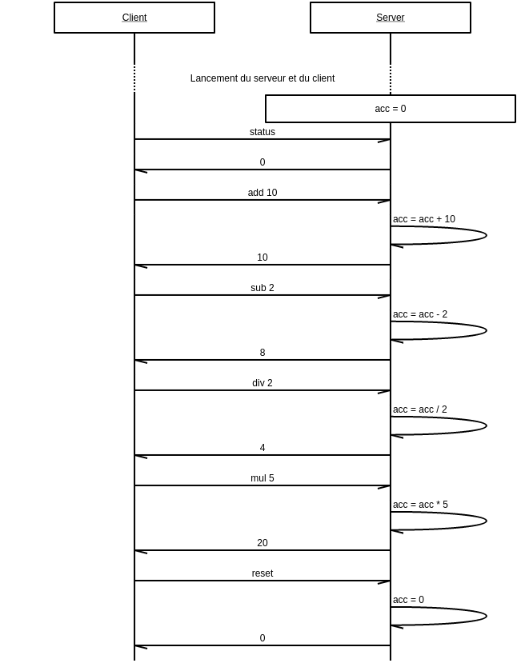

# Exercice: implémentation d'une calculatrice à état distribuée

## Consignes

Implémenter en NodeJS une application distribuée permettant d'effectuer les opérations arithmétiques simples. Cette application devra répondre aux contraintes suivantes:

- Elle devra suivre une architecture 2 tiers de classe 4.
- Le client devra utiliser le transport TCP/IP pour communiquer avec le serveur.
- Elle n'aura pas à supporter de multiples clients.
- Toutes les implémentations de la classe devront être compatibles, i.e. vous devez vous mettre d'accord sur un protocole commun de sérialisation/désérialisation des messages.

Le client/serveur devront gérer les instructions suivantes:

- `add` Requête d'addition
- `sub` Requête de soustraction
- `div` Requête de division
- `mul` Requête de multiplication
- `status` Requête de récupération de la valeur de l'accumulateur sur le serveur
- `reset` Requête de réinitialisation de la valeur de l'accumulateur sur le serveur.

Vous pouvez vous baser sur les fichiers `client.js` et `server.js` présents dans ce répertoire pour amorcer votre projet.

Si vous débutez avec NodeJS, des liens sont disponibles plus bas dans la section "Ressources".

### Phases de l'exercice

- **Phase 1** Lisez bien les consignes.
- **Phase 2** Concevez et mettez vous d'accord sur un protocole commun pour la sérialisation/desérialisation des instructions échangées entre le client et le serveur.
- **Phase 3** Implémentez votre client et serveur en fonction des spécifications que vous aurez établi.
- **Phase 4** Testez l'interopérabilité de vos implémentations en faisant pointer votre client vers le serveur d'un de vos collègues, et inversement.

## Exemple de séquence d'échange

## Ressources

- [Télécharger/installer NodeJS](https://nodejs.org/en/download/)
- [Le module `net` de NodeJS](https://nodejs.org/api/net.html)
- [NodeJS - Livre du débutant](https://nodejs.developpez.com/tutoriels/javascript/node-js-livre-debutant/)
